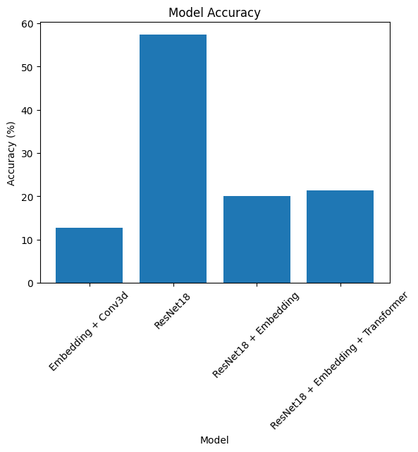

# Evaluating the Impact of Embeddings on Convolutional Neural Network Architectures

## Introduction

This research investigates the influence of incorporating embedding layers into convolutional neural network (CNN) configurations, specifically examining their performance in image classification tasks utilizing the CIFAR-10 dataset. This dataset comprises 60,000 color images categorized into 10 distinct classes.

## Experimental Setup

We evaluated the performance of the following model configurations:

1. **Embedding + Conv3D**
2. **ResNet18**
3. **ResNet18 + Embedding**
4. **ResNet18 + Embedding + Transformer**

Each model was trained and tested on the CIFAR-10 dataset to measure classification accuracy.

## Methodology Enhancements

In the configurations involving **ResNet18 + Embedding** and **ResNet18 + Embedding + Transformer**, a modification was introduced at the output of the ResNet18 feature layers. Specifically, a ReLU6 activation function was applied. This approach was intended to optimize the parameter settings of the embedding layers, potentially enhancing the model's ability to process and learn from the embedded features more effectively.

## Results

The obtained accuracies from the experiments are:

- **Embedding + Conv3D**: 12.69% accuracy
- **ResNet18**: 57.36% accuracy
- **ResNet18 + Embedding**: 20.01% accuracy
- **ResNet18 + Embedding + Transformer**: 21.41% accuracy

## Analysis

The baseline ResNet18 model outperformed the other configurations with a notable accuracy of 57.36%. The integration of embeddings, even with the parameter optimization provided by the ReLU6 activation, did not yield a performance improvement. Instead, it resulted in lower accuracies. This suggests that while the embedding layers are theoretically capable of enhancing feature representation, their practical application in conjunction with the ResNet18 architecture requires further refinement.

## Conclusion

The study underscores that traditional CNN architectures such as ResNet18 may perform optimally without additional embeddings for tasks like image classification on the CIFAR-10 dataset. Future research should focus on optimizing the integration of embedding layers, possibly exploring alternative activation functions or embedding techniques to better complement the primary CNN architecture. Moreover, it is crucial to consider the compatibility of embedding parameters with the core network to fully leverage the potential of advanced feature representations.